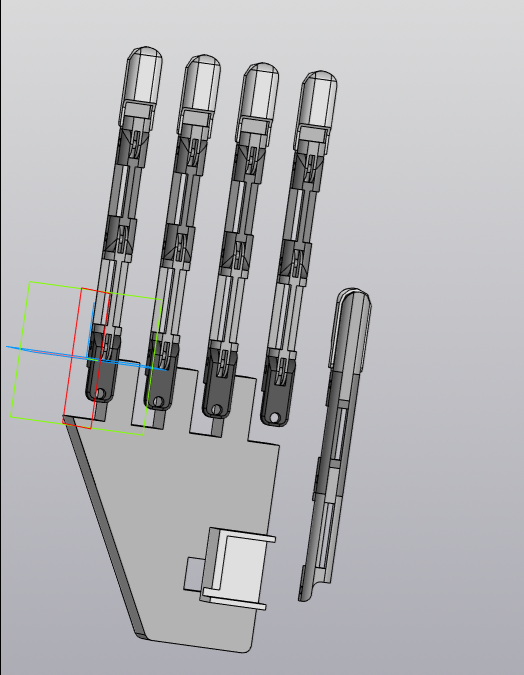
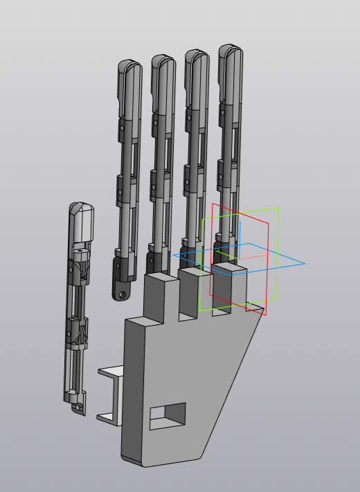
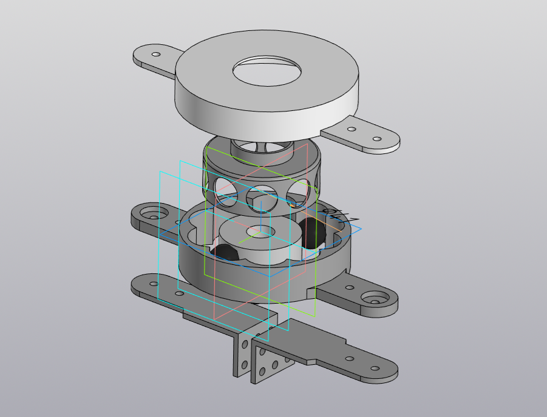

# Cases
Портфолио
Вот пример файла `README.md` для вашего проекта:

```markdown
# COMPAS-3D-Examples

Этот репозиторий содержит примеры 3D-моделей, созданных с использованием COMPAS и других инструментов для работы с 3D-графикой. Здесь вы найдете различные примеры моделей, включая руки, колеса и волновые передачи.

## Содержание

- [Примеры файлов](#примеры-файлов)
- [Как использовать](#как-использовать)
- [Скриншоты](#скриншоты)
- [Лицензия](#лицензия)

## Примеры файлов

- **Hand-COMPAS-3D.png**: Скриншот 3D-модели руки.
- **Palm-with-fingers.a3d**: 3D-модель ладони с пальцами в формате `.a3d`.
- **Wheel.a3d**: 3D-модель колеса в формате `.a3d`.
- **Hand-rear-view.png**: Задняя проекция 3D-модели руки.
- **Wave_transmission_with_intermediate_rolling_elements.png**: Скриншот модели волновой передачи с промежуточными элементами качения.
- **Wheel.stl**: 3D-модель колеса в формате `.stl`.

## Как использовать

1. Клонируйте репозиторий:
   ```bash
   git clone https://github.com/your-username/COMPAS-3D-examples.git
   ```
2. Откройте файлы в вашем любимом 3D-редакторе или инструменте для работы с 3D-моделями.
3. Исследуйте и модифицируйте модели по своему усмотрению.

## Скриншоты

### Hand-COMPAS-3D.png


### Hand-rear-view.png


### Wave_transmission_with_intermediate_rolling_elements.png


## Лицензия

Этот проект распространяется под лицензией MIT. Подробности смотрите в файле [LICENSE](LICENSE).
```
